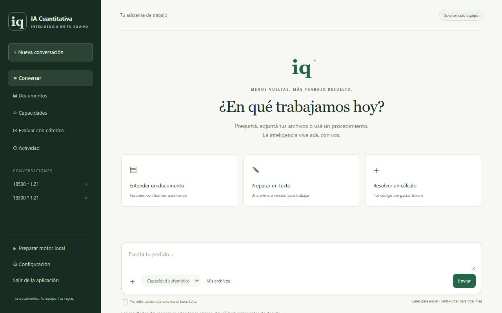
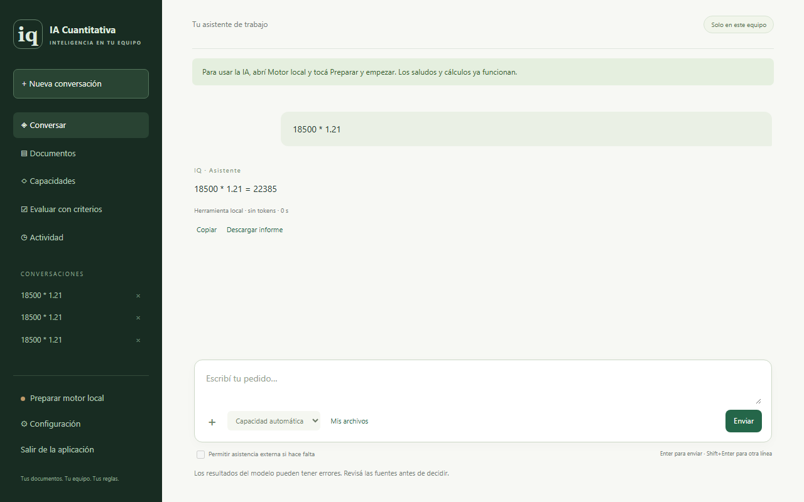
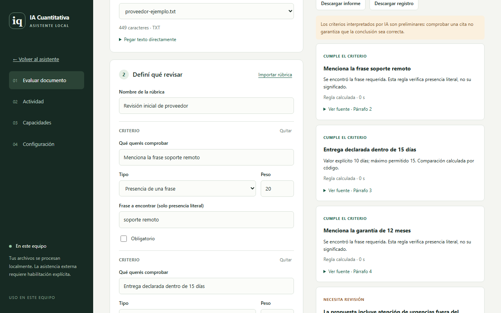
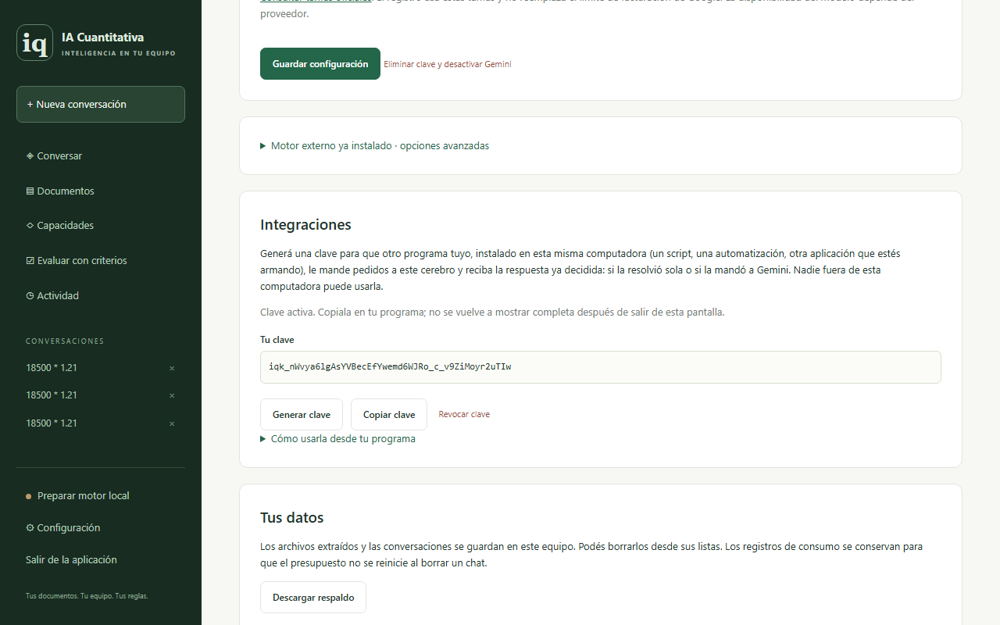

# IA Cuantitativa

**Menos vueltas. Más trabajo resuelto.**

[](https://github.com/ariel-veraas/IA-Cuantitativa/actions/workflows/ci.yml)
[](LICENSE)


IA Cuantitativa es un asistente de IA que corre **en tu computadora**, pensado para negocios que no se pueden dar el lujo de pagar un producto cloud ni de tener un ingeniero dedicado. No es un chatbot genérico: es un cerebro que decide — por cada pedido — si lo puede resolver solo, con el modelo liviano que ya tiene cargado, o si necesita pedir ayuda externa. Y cuando pide ayuda, le manda a esa API solo el contexto que hace falta, no todo.



## Qué hace bien

- **Razona cuando hace falta, no siempre igual.** Un saludo o un cálculo se resuelven al instante, sin tocar el modelo. Un pedido que compara, justifica o encuentra contradicciones activa razonamiento extendido antes de responder.
- **Reconsidera antes de rendirse.** Si el primer intento local no alcanza y hay más documento sin usar, lo vuelve a intentar con más contexto antes de pensar en ayuda externa.
- **Comprime el contexto antes de pagar.** Cuando de verdad hace falta escalar a Gemini, una llamada local gratuita elige como máximo los fragmentos necesarios — no reenvía todo lo que ya tenía.
- **Revisa documentos con criterios, no con una opinión.** Reglas literales y numéricas resueltas por código (0 tokens, 0 segundos), más criterios de interpretación con IA — cada cita se comprueba contra el texto real, nunca se confía en la palabra del modelo.
- **Capacidades que se corrigen con el uso.** Marcá una respuesta como buena o mal, y la app junta esas correcciones para proponerte una versión mejorada de sus propias instrucciones — que igual tiene que volver a pasar su prueba antes de activarse.
- **Se integra con lo que ya tenés.** Una clave estable para que otro programa tuyo (un script, una automatización, un flujo de n8n) le mande pedidos al cerebro y reciba la decisión ya tomada. Incluye un conector de referencia por correo, listo para usar.
- **Corre sin placa de video.** Detecta tu hardware y te recomienda el perfil liviano si no tenés GPU — validado con el modelo real, no solo en el papel.

## Por qué existe

Gran parte del costo de tener IA local viene de que los modelos están pensados para ser generalistas: para responder cualquier cosa necesitan "saberlo todo", y eso pesa. Pero un negocio chico no necesita un modelo que sepa todo — necesita algo que piense como una persona resolviendo su propio trabajo: intenta, si no le alcanza busca más información, y recién ahí decide. Ese pensamiento recursivo y acotado es más barato que el conocimiento enciclopédico, y es exactamente lo que este proyecto construye.

## Cómo decide

```text
   Pedido
      │
      ▼
Intento local (¿necesita razonar? → heurística, no otra llamada)
      │
      ├─ Alcanza ──────────────────────────────► Respuesta
      │
      ▼ (needs_help)
Reconsidera con más contexto local (solo si hay más para ofrecer)
      │
      ├─ Alcanza ──────────────────────────────► Respuesta
      │
      ▼ (needs_help, y el usuario lo habilitó)
Búsqueda web real (opt-in) → se revalida localmente, nunca se confía directo
      │
      ▼ (sigue sin alcanzar)
Compresión de contexto (gratis) → escalamiento a Gemini con lo mínimo necesario
```



## Revisar documentos con criterios

Cargás un documento, definís qué tiene que cumplir — una frase obligatoria, un valor numérico máximo, o un criterio que necesita interpretación — y la app te dice qué cumple, qué no, y qué necesita una segunda mirada. Cada cita se verifica contra el texto original antes de mostrarse.



## Integrarlo con otro programa

Desde Configuración generás una clave para que otro programa tuyo, en esta misma computadora, le mande pedidos al cerebro y reciba la decisión ya tomada — sin depender del token de sesión de la interfaz.



`integrations/asistente_email.py` es un conector de referencia funcional: lee correos nuevos por IMAP, le pregunta al cerebro qué hacer con cada uno, y arma un borrador de respuesta — nunca envía nada automáticamente, siempre queda para que una persona lo revise. El mismo patrón sirve de plantilla para WhatsApp, un CRM o un sistema de tickets.

## Instalar y correr

**Si no sos técnico:** descargá el ejecutable de Windows, abrilo, y seguí la preparación guiada del motor local (descarga Ollama y el modelo por vos). No necesitás instalar Python ni usar una terminal. Ver [LEEME.md](LEEME.md) para el detalle completo.

**Si querés correrlo desde el código:**

```bash
git clone https://github.com/ariel-veraas/IA-Cuantitativa.git
cd IA-Cuantitativa
pip install -r requirements.txt
python run.py
```

Se abre en `http://127.0.0.1:8765`.

## Pruebas

97 pruebas automatizadas (Python) + 3 (Go), corriendo en CI en cada push. Además de tests con transporte simulado, el comportamiento adaptativo (razonamiento, reconsideración, capacidades que se auto-mejoran) se validó contra modelos reales corriendo en Ollama — Qwen3 4B y Qwen3 1.7B, el perfil que la app recomienda cuando no hay GPU.

```bash
python -m unittest discover -s tests -p "test_*.py"
```

## Limitaciones actuales

- El `.exe` de Windows no tiene firma de editor — Windows va a mostrar una advertencia la primera vez que alguien más lo abra.
- El escalamiento a Gemini y la búsqueda web nunca se probaron contra una cuenta paga real; el control de presupuesto está probado en el código, no en una factura real.
- No hay actualización automática: instalar hoy te deja en esta versión.
- Las capacidades propias soportan un solo caso de prueba, no varios.
- Solo hay un conector de referencia (correo); WhatsApp, un CRM o un helpdesk necesitan el mismo patrón pero todavía no están armados.

## Privacidad

Los documentos, conversaciones y capacidades se procesan y guardan en tu computadora. Gemini es opcional, está desactivado por defecto, y cada pedido necesita habilitación explícita para usarlo.

## Licencia

MIT
