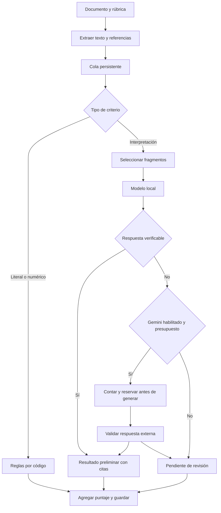

# Arquitectura implementada · 0.1

## Decisión de alcance

El primer proceso es evaluación documental. Permite verificar la idea central con una tarea útil y acotada: herramientas para lo determinista, un modelo pequeño para interpretar, contexto seleccionado y escalamiento externo explícito. No se implementa todavía un asistente general ni una colección de modelos residentes.

Para esta etapa se eligieron Python estándar, HTML/CSS/JavaScript sin compilación y SQLite. Reducen dependencias para probar el flujo. El servidor HTTP estándar es una elección del laboratorio; un piloto compartido requerirá otro despliegue, autenticación y aislamiento.

El modo sin modelo omite la llamada local. Si el usuario habilita explícitamente Gemini para ese trabajo y la configuración lo permite, los criterios semánticos pendientes pueden escalar directamente. Las reglas incompletas quedan pendientes: no se transforman silenciosamente en criterios de IA.

## Componentes y contratos

| Componente | Responsabilidad |
|---|---|
| `iq/server.py` | HTTP de loopback, sesión, validación de origen, rutas y archivos estáticos |
| `iq/app.py` | Casos de uso, configuración y un worker de evaluación |
| `iq/lock.py` | Propietario único de la carpeta de datos |
| `iq/documents.py` | Lectores, límites, referencias y selección léxica |
| `iq/domain.py` | Validación de rúbrica y agregación de pesos |
| `iq/evaluator.py` | Reglas, flujo por criterio, citas, checkpoints e informes |
| `iq/providers.py` | Contratos de llama.cpp y Gemini; sin reintentos generativos automáticos |
| `iq/store.py` | Documentos, trabajos, ledger de gasto y recuperación |
| `iq/skills.py` | Catálogo permitido y carga diferida de la skill |
| `iq/diagnostics.py`, `iq/benchmark.py` | Diagnóstico y medidas sobre un servidor local existente |
| `iq/static/` | Interfaz sin servicios externos ni dependencias de compilación |

El modelo recibe solamente un criterio y los fragmentos seleccionados; devuelve `status`, `explanation` y `evidence`. Los estados permitidos son `meets`, `does_not_meet` y `needs_review`. No calcula puntajes, no asigna permisos ni ejecuta acciones. El código comprueba identificadores de fragmentos y citas antes de aceptar una conclusión.

El proveedor local expone `/v1/chat/completions` con JSON restringido por esquema. El adaptador externo usa `countTokens` y `generateContent`, con `thinkingBudget: 0`. La aplicación restringe los modelos externos a los dos IDs que contempla ese adaptador. Ampliarlos requiere revisar el contrato y la contabilidad, no solo cambiar una cadena.

## Skills desde la primera versión

`skills/evaluar-documento` contiene `SKILL.md` y un manifiesto. El catálogo muestra metadatos; el cuerpo de instrucciones se carga al crear una evaluación. El trabajo guarda versión, texto y SHA-256 de la skill, además de su rúbrica y configuración. Una edición posterior no cambia el procedimiento de un trabajo ya creado.

La skill describe el procedimiento y los límites. El handler permitido en Python define las operaciones reales. La carpeta no es un mecanismo de instalación de plugins arbitrarios: copiar otra carpeta allí no otorga permisos ni ejecuta scripts. Esta decisión conserva una superficie pequeña mientras se valida el producto.

Cambiar una rúbrica permite reutilizar esta capacidad en distintos documentos. Enseñar y publicar nuevas skills desde una conversación, probarlas automáticamente, aprobar versiones y revertirlas sigue pendiente. No hay aprendizaje autónomo ni entrenamiento del modelo en esta entrega.

## Recursos y recuperación

Solo se procesa un trabajo a la vez. El motor de inferencia queda en un proceso externo persistente; la app no carga pesos. Los lectores solo se importan cuando se necesitan. No hay embeddings, base vectorial, contenedores, agentes en paralelo ni modelos especialistas residentes.

Los fragmentos tienen hasta 1.500 caracteres y solapamiento de 200. La selección por palabras tiene un presupuesto configurable en caracteres. Es una primera restricción de contexto, no un compresor semántico ni una garantía de tokens exactos. Su recall debe medirse antes de usar documentos largos para decisiones importantes.

Cada criterio terminado produce un checkpoint. El arranque convierte trabajos activos en interrumpidos y reservas en gasto incierto. Un bloqueo del sistema operativo impide iniciar otro worker sobre la misma carpeta. Reanudar continúa con criterios faltantes; si había un intento externo, no se repite automáticamente.

La reserva de gasto usa enteros en microdólares y una transacción SQLite. El mes se calcula en UTC. Las tarifas son configuración del operador; el registro no sustituye la factura del proveedor. Hay un bloqueo conservador si un uso contabilizado supera su reserva y todavía no se implementó una interfaz de conciliación.

## Próximas entregas, en orden

1. **Validar en el equipo de prueba.** Registrar sistema, RAM, GPU/VRAM; medir saludo, evaluación, memoria, primera respuesta y latencia sostenida con uno o dos modelos cuantizados. Elegir por calidad y rendimiento, no por tamaño solamente.
2. **Evaluación con casos reales.** Reunir documentos anonimizados, etiquetas y criterios acordados; incluir negaciones, contradicciones, tablas, páginas vacías y evidencia fuera de los fragmentos recuperados. Medir errores y abstenciones.
3. **Calidad de extracción y recuperación.** OCR opcional bajo demanda, tratamiento de tablas y retrieval híbrido si los casos muestran que mejora resultados. Medir costo de cada componente antes de agregar otro modelo.
4. **Experiencia sin conocimientos técnicos.** Instalador, detección de hardware, descarga verificada de modelos, prueba automática de conexión y perfiles de memoria. Estos pasos son centrales para llegar al público objetivo.
5. **Skills enseñables.** Editor guiado, esquemas de entrada/salida, pruebas, catálogo, permisos, versiones y reversión. Separar propuesta de publicación.
6. **Piloto empresarial.** Autenticación, roles, retención/borrado, aislamiento de lectores y herramientas, actualización segura, cifrado conforme al entorno y observabilidad. Agregar conectores cuando haya un proceso probado que los necesite.

No se incluyen fechas ni promesas de rendimiento sin conocer el hardware y los documentos del laboratorio. La condición para ampliar el alcance es mejorar métricas concretas del proceso, manteniendo instalabilidad y costos visibles.
